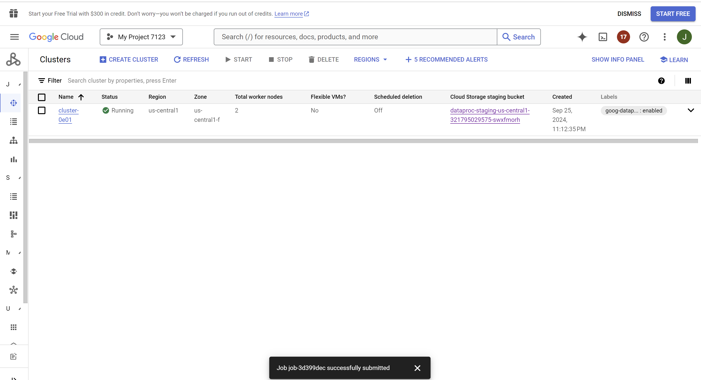

# Team

## Team members' names 

1. Student Name: Surya Sunkari

   Student UT EID: svs879

2. Student Name: Shaan Kumar

   Student UT EID: sk55838

3. Student Name: Jordyn Nevelle

   Student UT EID: jrn2365


##  Course Name: CS378 - Cloud Computing 

##  Unique Number: 51515
    

# Project Report

## Google Cloud Machines

**Dataproc Cluster:**<br>


**VM Instances:**<br>


## Yarn History

**Task 1:**<br>


**Task 2:**<br>


**Task 3:**<br>


# Project Template

# Running on Laptop 

Prerequisite:

- Maven 3

- JDK 1.6 or higher

- (If working with eclipse) Eclipse with m2eclipse plugin installed


The java main class is:

edu.cs.utexas.HadoopEx.WordCount 

Input file:  Book-Tiny.txt  

Specify your own Output directory like 

# Running:

mvn clean package

**TASK 1:**<br>
java -jar target/GPSErrorDetectionDriver-jar-with-dependencies.jar taxi-data-sorted-small.csv output/task1
<br>
<br>
**TASK 2:**<br>
java -jar target/TaxiAndErrorDriver-jar-with-dependencies.jar taxi-data-sorted-small.csv intermediate/task2 output/task2
<br>
<br>
**TASK 3:**<br>
java -jar target/DriverEarningsDriver-jar-with-dependencies.jar taxi-data-sorted-small.csv intermediate/task3 output/task3

# Relevant files per Task:
**Task 1:**
GPSErrorDetectionDriver
GPSErrorDetectionMapper
GPSErrorDetectionReducer
Utils

**Task 2:**
TaxiAndErrorCount
TaxiAndErrorDriver
TaxiAndErrorMapper
TaxiAndErrorReducer
TopFiveErrorMapper
TopFiveErrorReducer
IntPairWritable
Utils

**Task 3:**
DriverEarnings
DriverEarningsDriver
EarningsPerMinuteMapper
EarningsPerMinuteReducer
TopTenDriversMapper
TopTenDriversReducer
IntDoublePairWritable
Utils


## Create a JAR Using Maven 

To compile the project and create a single jar file with all dependencies: 
	
```	mvn clean package ```


## Run your application
Inside your shell with Hadoop

Running as Java Application:

```java -jar target/MapReduce-WordCount-example-0.1-SNAPSHOT-jar-with-dependencies.jar SOME-Text-Fiel.txt  output``` 

Or has hadoop application

```hadoop jar your-hadoop-application.jar edu.cs.utexas.HadoopEx.WordCount arg0 arg1 ... ```


## Create a single JAR File from eclipse


Create a single gar file with eclipse 

*  File export -> export  -> export as binary ->  "Extract generated libraries into generated JAR"
